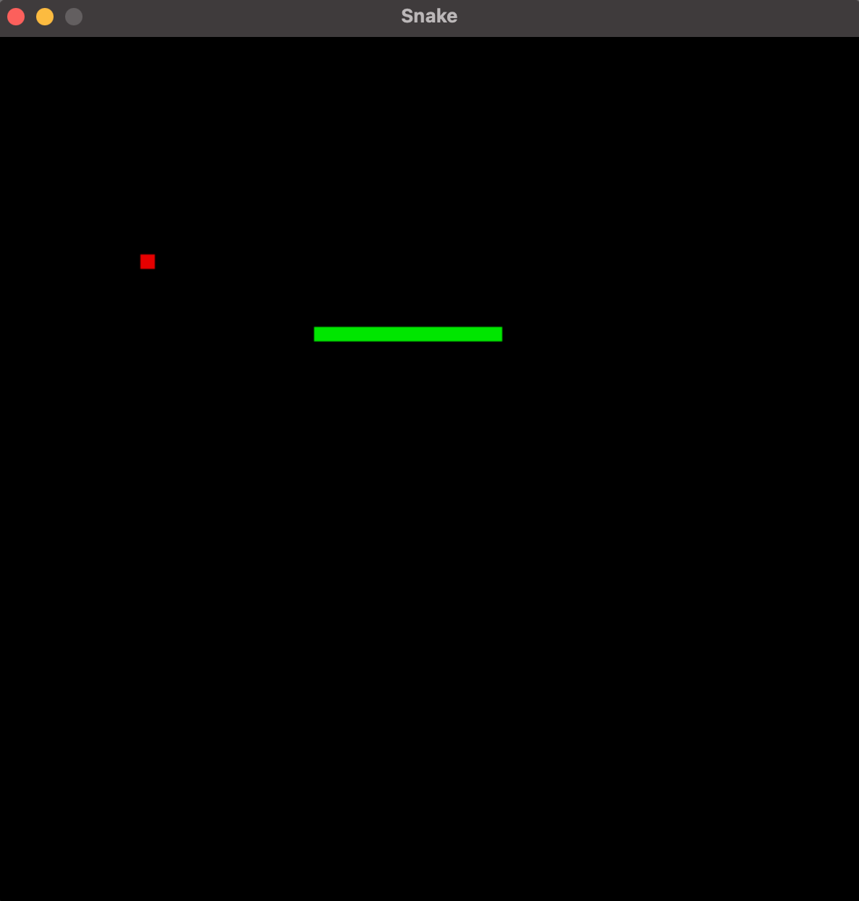

# Snake

This repository contains a snake game written in python which makes use of pygame.

## Usage

Run the main game file `snake.py`.
Use the arrow keys to change the direction the snake is traveling.
Increase the snakes size by eating the red food.
The game will continue until the snake enters a square it already occupies, 
upon which the window will close.

## Future Elaborations
* Improved controls
* Starting menu
* Score indicator
* Ending screen
* Color and other customization options

## Licence

MIT License\
See LICENSE for details.